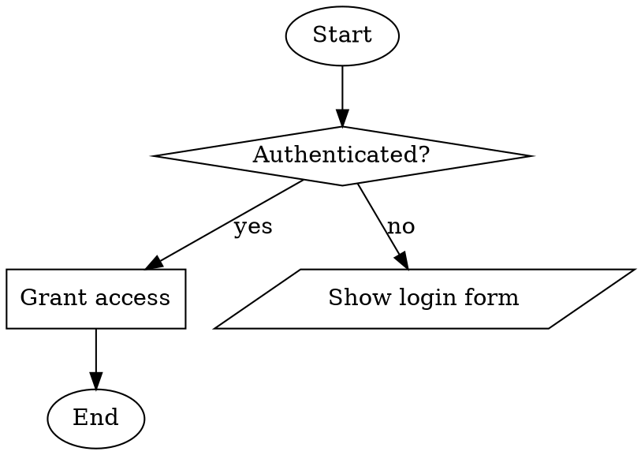
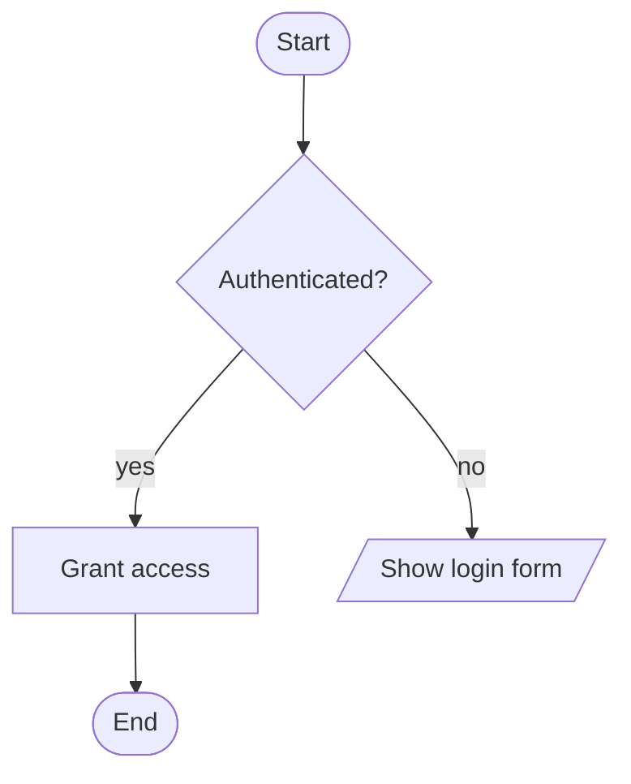

# Examples

## Authentication Policy Flow

### Session

```
> add startend "Start"
Added node n1
> add decision "Authenticated?"
Added node n2
> add action "Grant access"
Added node n3
> add io "Show login form"
Added node n4
> add startend "End"
Added node n5
> connect n1 n2
Connected n1 -> n2
> connect n2 n3 yes
Connected n2 -> n3
> connect n2 n4 no
Connected n2 -> n4
> connect n3 n5
Connected n3 -> n5
> set-root n1
Root set to n1
> preview
([Start])
└── <Authenticated?>
    ├── [yes] [Grant access]
    │   └── ([End])
    └── [no] //Show login form//
> save auth-flow.json
Saved to auth-flow.json
```

### DOT Output



### Mermaid Output



## Fire Handling Procedure

### Session

```
> add startend "Fire detected"
Added node n1
> add decision "Small fire?"
Added node n2
> add action "Use extinguisher"
Added node n3
> add action "Evacuate building"
Added node n4
> add action "Call fire department"
Added node n5
> add startend "Done"
Added node n6
> connect n1 n2
Connected n1 -> n2
> connect n2 n3 yes
Connected n2 -> n3
> connect n2 n4 no
Connected n2 -> n4
> connect n3 n6
Connected n3 -> n6
> connect n4 n5
Connected n4 -> n5
> set-root n1
Root set to n1
> preview
([Fire detected])
└── <Small fire?>
    ├── [yes] [Use extinguisher]
    │   └── ([Done])
    └── [no] [Evacuate building]
        └── [Call fire department]
```

### JSON Format

```json
{
  "name": "untitled",
  "root_id": "n1",
  "nodes": {
    "n1": { "id": "n1", "type": 2, "label": "Fire detected" },
    "n2": { "id": "n2", "type": 0, "label": "Small fire?" },
    "n3": { "id": "n3", "type": 1, "label": "Use extinguisher" },
    "n4": { "id": "n4", "type": 1, "label": "Evacuate building" },
    "n5": { "id": "n5", "type": 1, "label": "Call fire department" },
    "n6": { "id": "n6", "type": 2, "label": "Done" }
  },
  "edges": [
    { "from": "n1", "to": "n2" },
    { "from": "n2", "to": "n3", "label": "yes" },
    { "from": "n2", "to": "n4", "label": "no" },
    { "from": "n3", "to": "n6" },
    { "from": "n4", "to": "n5" }
  ],
  "counter": 6
}
```
